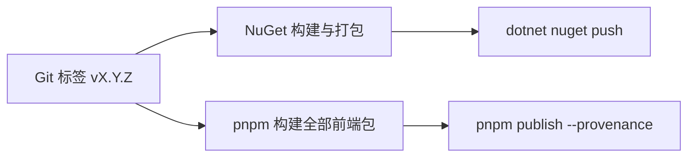

# 插件前后端一体发布（双包模型）与 vite 调用指南

> 本文档定义 Wails.Net 插件的**前后端一体发布模型**：一个插件 = 后端 NuGet 包 + 前端 npm 包，同仓库、同版本发布，vite 项目（React/Vue）经 npm 依赖直接调用并获得完整 TypeScript 代码提示。
>
> - **更新日期**：2026-08-07
> - **适用版本**：Wails.Net `0.1.0-alpha.1` 及以上
> - **参考实现**：
>   - Tauri v2 插件模型（`tauri-plugin-*` crate + `@tauri-apps/plugin-*` npm 包）
>   - Wails v3 `v3.0.0-beta.4` 可安装插件（服务打包前端资源 + 脚本）
>   - 差异确认见 [wails-v3-beta-comparison.md](wails-v3-beta-comparison.md)（P0-1 可安装插件）

---

## 1. 背景与目标

### 1.1 现状问题

当前插件体系只有**后端命令注册**（`IPlugin` / `PluginManager`，45+ BuiltIn 插件），前端封装全部聚合在 `@wails-net/runtime` 单包内（`src/api/*.ts`）：

| 现状 | 问题 |
|------|------|
| 前端类型集中在 `@wails-net/runtime` | 包体积随插件数增长，无法按需安装 |
| 插件无前端资产承载 | 第三方无法分发「UI + 逻辑」一体功能包 |
| 插件 API 变更无类型约束 | 前端拼错命令名/参数只能运行时才发现 |

### 1.2 目标形态

一个插件 = **双包**，同仓库同版本发布：

```
插件源码（单一版本号）
├── src/Wails.Net.Plugins.{Name}/      → NuGet 包  Wails.Net.Plugins.{Name}
└── packages/wails-net-plugin-{name}/  → npm 包    @wails-net/plugin-{name}
```

- **NuGet 包**：后端命令注册 + 权限声明 + 内嵌前端资源（可选）
- **npm 包**：TS 强类型封装（薄壳调 `wails.call`）+ 编译产物 + `.d.ts`

vite 项目用法：

```ts
import { checkForUpdate } from "@wails-net/plugin-updater";  // 类型全自动
```

---

## 2. 双包架构总览

```
┌─────────────────────── 插件源码（单一仓库 / 单一版本号）───────────────────────┐
│                                                                             │
│  Wails.Net.Plugins.Updater (C#)          @wails-net/plugin-updater (TS)     │
│  ├─ 命令注册 + 权限声明                    ├─ 强类型封装（调 wails.call）       │
│  └─ 内嵌前端资源 (EmbeddedResource)        └─ dist/index.d.ts（类型自动随包）  │
└──────────────┬──────────────────────────────────┬───────────────────────────┘
               │  NuGet 发布                         │  pnpm publish --provenance
               ▼                                      ▼
        nuget.org                              npm registry
               ▲                                      ▲
               │  后端引用                              │  pnpm add
               │                                      │
┌──────────────┴──────────────────────────────────┴───────────────────────────┐
│  vite 项目（React/Vue）                                                      │
│  ├─ package.json: "@wails-net/plugin-updater": "workspace:*" | "1.x.y"      │
│  └─ App.tsx: import { checkForUpdate } from "@wails-net/plugin-updater"     │
└─────────────────────────────────────────────────────────────────────────────┘
```

**关键原则**：

1. **同仓库**：插件前后端代码在同一仓库、同一 PR 中维护，保证 API 一致
2. **同版本**：NuGet 版本（`WailsNetVersion`）与 npm 版本（package.json）必须一致，发布脚本同时 bump
3. **npm 包是薄壳**：前端封装只做类型化调用转发，不含业务逻辑，逻辑在后端
4. **runtime 是核心**：`@wails-net/runtime` 保留核心命名空间（window/clipboard/events/dialog/fs 等）+ 插件包的公共基座，插件包依赖它

---

## 3. 目录与命名约定

### 3.1 目录结构

| 位置 | 内容 | 发布产物 |
|------|------|---------|
| `src/Wails.Net.Plugins.{Name}/` | 后端插件实现（IPlugin 子类 + 命令） | NuGet `Wails.Net.Plugins.{Name}` |
| `packages/wails-net-plugin-{name}/` | 前端封装（TS 源码 + 构建配置） | npm `@wails-net/plugin-{name}` |
| `packages/wails-net-runtime/` | 核心运行时（已有，保留） | npm `@wails-net/runtime` |

命名映射：后端 `Wails.Net.Plugins.Updater` ↔ 前端 `@wails-net/plugin-updater`（PascalCase → kebab-case）。

### 3.2 后端项目规范（NuGet 包）

```xml
<!-- src/Wails.Net.Plugins.Updater/Wails.Net.Plugins.Updater.csproj -->
<Project Sdk="Microsoft.NET.Sdk">
  <PropertyGroup>
    <PackageId>Wails.Net.Plugins.Updater</PackageId>
    <Description>Wails.Net 更新检查插件（前后端一体包）</Description>
  </PropertyGroup>
  <ItemGroup>
    <!-- 内嵌前端资源：随 NuGet 分发，运行时按需挂载 -->
    <EmbeddedResource Include="frontend/**/*" PackagePath="staticwebassets/" />
  </ItemGroup>
</Project>
```

后端插件实现遵循 AGENTS.md 规范：

- `IPlugin` 生命周期：`ConfigureServices` / `Configure` / `StartupAsync` / `ShutdownAsync`
- 命令注册：`context.Commands.MapCommand("updater.checkForUpdate", ...)`
- 权限声明：`context.Permissions`（对齐 Tauri v2 插件 permissions）
- **禁反射**（AGENTS.md §3.4）：命令方法必须经源生成器/`MapCommand` 注册，不得 `MethodInfo.Invoke`
- **CancellationToken 约定**（AGENTS.md §3.4.6）：从 `ICommandContext.CancellationToken` 获取，不得作为前端 JSON 参数

### 3.3 前端项目规范（npm 包）

```
packages/wails-net-plugin-updater/
├── package.json          # name: @wails-net/plugin-updater
├── tsconfig.json         # 构建配置（对齐 runtime 包）
├── src/
│   └── index.ts          # 强类型封装（唯一入口）
└── dist/                 # 构建产物（index.js + index.d.ts）
```

`package.json` 要点：

```jsonc
{
  "name": "@wails-net/plugin-updater",
  "version": "0.1.0",                      // 必须与 WailsNetVersion 一致
  "type": "module",
  "main": "./dist/index.js",
  "types": "./dist/index.d.ts",            // 类型入口，vite 自动识别
  "exports": {
    ".": { "types": "./dist/index.d.ts", "import": "./dist/index.js" },
    "./package.json": "./package.json"
  },
  "files": ["dist"],
  "dependencies": { "@wails-net/runtime": "workspace:*" }  // 依赖核心运行时
}
```

`src/index.ts` 封装形态（**`defineCommand` 抽象**，推荐）：

```ts
/**
 * @wails-net/plugin-updater — Updater 插件前端封装。
 * 命令前缀 `updater.*`，后端经 L2 抽象层 `defineCommand` 转发（强类型化）。
 */
import { defineCommand } from "@wails-net/runtime";

/** 更新通道。对应后端 enum UpdateChannel。 */
export type UpdateChannel = "stable" | "beta";

/** 更新清单。对应后端 UpdateManifest（字段映射自 C# 模型）。 */
export interface UpdateManifest {
  version: string;
  notes?: string;
  downloadUrl?: string;
}

/** 检查更新（single：参数对象自动包装为 [{ channel }]）。 */
export const checkForUpdate = defineCommand<[UpdateChannel], UpdateManifest>(
  "updater.checkForUpdate", "single");

/** 获取当前版本（none：无参数）。 */
export const getCurrentVersion = defineCommand<[], string>("updater.getCurrentVersion", "none");
```

调用体验（抽象验收标准：**应用侧调用方式不变**）：

```ts
const manifest = await checkForUpdate("stable");
//    ^? CancellablePromise<UpdateManifest> —— 参数类型约束 + 返回值推导 + 可取消
```

### 3.3.1 L2 命令抽象层（runtime 提供，消除样板）

插件封装底层是 `wails.call(name, args)`，线协议约定：`args.length === 1` 取整体反序列化、`> 1` 按位置、`0` 用 default。若每个插件手写，每命令要重复 5 件套（命令名拼接、参数打包、返回泛型、可选参数 null 填充、线协议映射）。

**`@wails-net/runtime` 的 L2 抽象层**（`src/core/commands.ts`）把这 5 件套收进公共设施：

```ts
/** 参数打包模式，对应线协议约定。 */
export type PackMode =
  | "none"    // 无参数 → 发送 []
  | "single"  // 单业务参数 → 包成 [{...}]，后端按唯一参数整体反序列化
  | "spread"; // 多位置参数 → 展开 [...], 后端按位置逐个反序列化

/** 定义一条类型化命令（A=参数元组，R=返回类型，由调用方锚定）。 */
export function defineCommand<A extends unknown[], R>(
  name: string,
  pack: PackMode,
): (...args: A) => CancellablePromise<R>;
```

| PackMode | 发送的 wire | 后端行为 | 适用示例 |
|----------|------------|---------|---------|
| `none` | `[]` | 传 `default` | `getCurrentVersion()` |
| `single` | `[args[0]]` | 取 `args[0]` 整体反序列化 | `checkForUpdate("stable")`（单对象/单值） |
| `spread` | `args`（原样） | 按位置逐个反序列化 | `setSize(width, height)`（多位置参数） |

**设计权衡**（为什么不用注册表/反射）：

| 方案 | 类型提示 | 样板 | 结论 |
|------|---------|------|------|
| `defineCommand`（采用） | ✅ 完整（参数/返回/可取消） | 每命令 1 行 | 平衡点 |
| 声明式注册表（对象描述符） | ❌ 参数名/注释丢失 | 最少 | 提示退化，否决 |
| 运行时反射生成 | ❌ 静态类型失效 | 零 | 违背 TS 哲学，否决 |

`defineCommand` 通过泛型把类型"钉"在导出变量上——是"零样板"与"类型提示"两个目标的唯一平衡点。

**类型生成策略**（两种可选，推荐 A）：

| 策略 | 做法 | 适用 |
|------|------|------|
| A. **手工强类型**（推荐） | 后端 C# 模型 → 前端 interface 手动对齐 + `defineCommand` 一行声明；签名由 `TypeScriptGenerator` 的 `MapTypeToTypeScript` 规则导出 | 起步阶段，包少、可控 |
| B. **生成器自动产出** | 源生成器/`Wails.Net.Generator` 为插件 `[Binding]` 方法直接产出 `defineCommand` 调用 + `.d.ts`，保留参数名与 XML 注释→JSDoc | 插件数量增多后自动化（对齐 Wails v3 beta 静态分析） |

---

## 4. vite 项目调用指南

### 4.1 安装

```bash
# 正式发布后：npm registry
pnpm add @wails-net/plugin-updater @wails-net/runtime

# 本地联调：pnpm workspace（仓库 pnpm-workspace.yaml 已含 packages/*）
# package.json 中声明：
#   "@wails-net/plugin-updater": "workspace:*"
#   "@wails-net/runtime": "workspace:*"
```

### 4.2 代码调用

```tsx
// App.tsx（React demo 为例）
import { checkForUpdate, getCurrentVersion } from "@wails-net/plugin-updater";
import { wails } from "@wails-net/runtime";

function UpdaterPanel() {
  const [version, setVersion] = useState<string>("");

  const onCheck = async () => {
    const manifest = await checkForUpdate("stable");
    //       ^? Promise<UpdateManifest> —— 参数枚举、返回类型、JSDoc 全部可用
    setVersion(manifest.version);
  };

  return <button onClick={onCheck}>检查更新（{version}）</button>;
}
```

### 4.3 类型提示与 tsconfig

- vite 项目 `moduleResolution: "bundler"` + `import` 方式：类型自动来自 `node_modules/@wails-net/plugin-updater/dist/index.d.ts`
- **零配置**：无需 `wails.d.ts` 全局声明、无需 tsconfig include 技巧（区别于方式 A）
- 校验命令：`npx tsc --noEmit`（React）/ `npx vue-tsc --noEmit`（Vue）

### 4.4 与「.d.ts 汇总」方式（方式 A）的分工

| 场景 | 推荐方式 | 理由 |
|------|---------|------|
| **vite 项目（React/Vue）** | npm 包（本文档） | 类型随包走、按需安装、版本对齐 |
| 无构建链静态 demo（21 个） | .d.ts 汇总（`src/wails.d.ts`） | 无 node_modules，编辑器类型提示靠 tsconfig include |
| 全局 `window.wails.plugins.*` 形态 | .d.ts 汇总 | 运行时注入管道（`GenerateRuntimeJs`）配合 |

两条线**互补不冲突**，均以 `@wails-net/runtime` 的类型为公共基座。

---

## 5. 版本对齐与发布流程

### 5.1 版本单一来源

- 后端：`Directory.Build.props` 的 `WailsNetVersion`（`0.1.0-alpha.1`），CI 以 Git 标签为准
- 前端：每个插件 `package.json` 的 `version`，**必须与 `WailsNetVersion` 一致**
- 发布脚本：同时 bump 两端，禁止只发一端

### 5.2 发布流水线（复用 LY.Tool 经验）



关键点：

| 环节 | 做法 |
|------|------|
| NuGet 发布 | `dotnet pack` + `dotnet nuget push`（见 [release-guide.md](release-guide.md)） |
| npm 发布 | `pnpm publish --provenance`（OIDC Trusted Publisher，对齐 LY.Tool release-frontend.yml 模式） |
| 版本一致性校验 | CI 脚本断言 `WailsNetVersion` == 各插件 package.json version，不一致即失败 |
| 前端产物完整性 | `dist/` 必须先构建（`pnpm build`），禁止发布未构建源码 |

### 5.3 本地联调（无发布）

```bash
# 1. 构建前端插件包
cd packages/wails-net-plugin-updater && pnpm build

# 2. 构建后端并输出到本地源（artifacts/ 已有惯例）
dotnet pack src/Wails.Net.Plugins.Updater -o artifacts/packages

# 3. vite demo 依赖声明 workspace:*，直接 pnpm install 即可联调
```

---

## 6. 落地顺序（里程碑）

| 阶段 | 内容 | 交付标准 |
|------|------|---------|
| **M1 示范插件** | 选 1 个插件（如 Updater）：建 `src/Wails.Net.Plugins.Updater` + `packages/wails-net-plugin-updater`，从 runtime 拆分对应封装（runtime 保留 re-export 向后兼容） | vite demo 改 import 插件包，`tsc --noEmit` 0 错误 |
| **M2 联调验证** | workspace:* 本地联调 + 类型提示截图核对 + `wails dev` 冒烟 | Demo 中插件命令可调用、类型提示完整 |
| **M3 批量拆分** | 其余插件按批迁移，runtime 变薄（仅核心命名空间 + 公共基座） | 全部 demo 构建通过，0 回归 |
| **M4 发布闭环** | CI 双包发布 + 版本一致性校验 + 文档配套 | 发版后从 registry 安装验证 |

**与差异确认文档的关系**：M1-M4 即 [wails-v3-beta-comparison.md](wails-v3-beta-comparison.md) §6 P0-1「可安装插件机制」的落地路径；本模型同时对齐 Tauri v2 插件生态（crate + npm 双包）。

---

## 7. 关联文档

| 文档 | 关联点 |
|------|--------|
| [AGENTS.md](../../AGENTS.md) | §3.4 禁反射协议、§3.4.6 CancellationToken 约定、§1.1.1 架构融合策略 |
| [wails-v3-beta-comparison.md](wails-v3-beta-comparison.md) | P0-1 可安装插件差异确认与收益分析 |
| [release-guide.md](release-guide.md) | 版本号管理与 NuGet 发布流程 |
| [project-structure-and-modes.md](project-structure-and-modes.md) | 前后端项目分布与 Debug/Release 模式 |
| [testing-strategy.md](testing-strategy.md) | 插件测试规范（TUnit） |

---

**最后更新**：2026-08-07（初版：双包发布模型 + vite 调用指南 + 发布流程 + 落地里程碑；§3.3 补 L2 命令抽象层 `defineCommand` 设计，消除手写样板）
