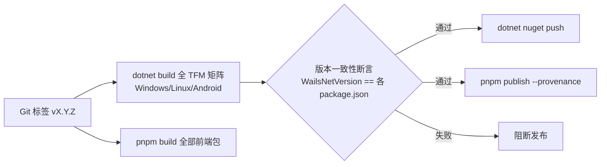

# 插件前后端拆分方案（按平台分层）

> 本文档定义 Wails.Net 插件在 **桌面端 / 安卓端 / 平台特有** 三个维度的前后端拆分模型，目标是在保持「一个插件 = NuGet 后端包 + npm 前端包」双包形态的同时，让平台能力边界清晰、开发与发布可落地。
>
> - **更新日期**：2026-08-07
> - **前置文档**：[plugin-packaging.md](plugin-packaging.md)（双包模型与 vite 调用）、[ADR-0002](../../ADR/0002-plugin-architecture.md)（插件架构决策）
> - **适用**：Wails.Net `0.1.0-alpha.1` 及以上

---

## 1. 目标与约束

### 1.1 目标

1. **平台分层清晰**：每个插件明确归属「纯托管跨平台 / 桌面通用 / 平台特有（Win/macOS/Linux/Android）」中的一层，包依赖方向单向。
2. **前后端一一对应**：后端插件包 ↔ 前端 npm 包，命名、版本、命令集严格对齐，vite 项目安装即得完整 TS 类型。
3. **开发体验好**：脚手架生成模板、本地 workspace/ProjectReference 联调、TUnit 无 GUI 测试、CI 一键双包发布。
4. **平台特有插件不拖累**：Keychain（仅 Win/macOS）、移动端 8 插件（仅 Android）按平台 TFM 构建，无实现的平台优雅降级（`PlatformNotSupportedException`），不强制安装。

### 1.2 约束（继承 AGENTS.md）

- **禁反射**（§3.4）：命令必须经 `MapCommand` 注册，平台实现经接口/委托注入，不得运行时反射发现。
- **CancellationToken**（§3.4.6）：从 `ICommandContext.CancellationToken` 获取，不得作为前端 JSON 参数。
- 平台注册走 `[ModuleInitializer]` + `PlatformFactory` 委托（AGENTS.md §3.4.3 白名单），已有多平台实现可复用。
- 版本单一来源：`WailsNetVersion`（`Directory.Build.props`）== 各插件 package.json version。

---

## 2. 47 个插件的平台分层

基于当前 `src/Wails.Net.Application/Plugins/` 源码逐插件核对（依赖方向：纯托管 < 桌面 < 平台特有）：

### L1 纯托管跨平台（13 个）—— 全部平台可编译可运行（含 Android）

| 插件 | 前缀 | 依赖说明 |
|------|------|---------|
| `HttpPlugin` | `http` | HttpClient，无平台依赖 |
| `WebSocketPlugin` | `websocket` | 托管 WebSocket |
| `UploadPlugin` | `upload` | HttpClient 封装 |
| `SqlPlugin` | `sqlite` | Microsoft.Data.Sqlite（已内嵌 native 依赖） |
| `StorePlugin` | `store` | Memory / JsonFile 后端 |
| `StrongholdPlugin` | `stronghold` | 托管加密（Blake2Fast/NSec） |
| `LogPlugin` | `log` | ILogger 桥接 |
| `LocalizationPlugin` | `localization` | 纯托管 i18n |
| `LocalhostPlugin` | `localhost` | 托管 HTTP listener |
| `OsInfoPlugin` | `os` | 环境变量 + RuntimeInformation |
| `AppInfoPlugin` | `app` | 程序集元数据 |
| `ProcessPlugin` | `process` | Process API（跨平台） |
| `PathPlugin` | `path` | Environment.SpecialFolder |

> 说明：`FileSystemPlugin` / `FsWatchPlugin` / `UpdaterPlugin` 核心逻辑纯托管，但涉及沙箱根/文件监听等平台差异较小，归入 L2 便于统一测试口径（亦可按需下调至 L1，拆分时按实际依赖判定）。

### L2 桌面通用（27 个）—— Windows / Linux / macOS，依赖平台抽象接口

| 插件 | 前缀 | 底层抽象（基座接口，平台程序集实现） |
|------|------|-------------------------------------|
| `WindowPlugin` | `window` | `IWebviewWindowImpl`（Win32WebviewWindow / LinuxWebviewWindow） |
| `WindowsPlugin` | `windows` | 同上（多窗口路由） |
| `WindowStatePlugin` | `window-state` | 窗口状态持久化（桌面 API） |
| `ScreenPlugin` | `screen` | `ScreenManager`（WinForms Screen / GTK） |
| `PositionerPlugin` | `positioner` | 窗口定位（桌面 API） |
| `MenuPlugin` | `menu` | `IMenuImpl`（Win32Menu / LinuxMenu） |
| `TrayPlugin` | `tray` | `ISystemTrayManager`（Win32SystemTray / LinuxSystemTray） |
| `NotificationPlugin` | `notification` | `NotificationService`（平台实现） |
| `DialogPlugin` | `dialog` | `DialogManager`（WinForms / GTK） |
| `ClipboardPlugin` | `clipboard` | `IClipboard`（WindowsClipboard / LinuxClipboard） |
| `OpenerPlugin` | `opener` | `IBrowserManager` + ShellExecute/gtk_show_uri |
| `ShellPlugin` | `shell` | Process + 白名单校验 |
| `GlobalShortcutPlugin` | `globalshortcut` | `IKeyBindingManager`（RegisterHotKey / GTK） |
| `AutostartPlugin` | `autostart` | `IAutostartManager`（注册表 / .desktop） |
| `PowerManagementPlugin` | `power-management` | 平台电源 API |
| `ApplicationPlugin` | `application` | `Application` 静态单例 + 平台能力 |
| `DpiScalePlugin` | `dpi-scale` | 窗口缩放 API |
| `FsWatchPlugin` | `fs-watch` | FileSystemWatcher（跨平台可用） |
| `FileSystemPlugin` | `filesystem` | 沙箱 + File API |
| `DeepLinkPlugin` | `deep-link` | 注册表 / .desktop URL scheme |
| `FileAssociationPlugin` | `file-association` | 注册表 / .desktop 文件关联 |
| `UpdaterPlugin` | `updater` | 多 Provider + 平台安装回调 |
| `CookiePlugin` | `cookie` | WebView2 / WebKit Cookie |
| `PersistedScopePlugin` | `persisted-scope` | 路径作用域（纯托管，按权限域归此层） |
| `CliPlugin` | `cli` | System.CommandLine 解析（跨平台） |
| `MenuPlugin` 配套 | — | MenuRole 角色菜单（Win/Linux 实现，macOS 骨架） |

### L3 平台特有（8 个）

| 插件 | 前缀 | 支持平台 | 拆分策略 |
|------|------|---------|---------|
| `KeychainPlugin` | `keychain` | **Windows / macOS**（Linux 无 `IPlatformKeychain` 实现） | 包定义接口 + `AddKeychain<TImpl>()` 注入；Linux 不注册实现，命令调用抛 `PlatformNotSupportedException` |
| `BiometricPlugin` | `biometric` | **Android** | 移动端包（android TFM），委托注入 |
| `NfcPlugin` | `nfc` | **Android** | 同上 |
| `BarcodeScannerPlugin` | `barcode-scanner` | **Android** | 同上 |
| `HapticsPlugin` | `haptics` | **Android** | 同上 |
| `CameraPlugin` | `camera` | **Android** | 同上 |
| `GeolocationPlugin` | `geolocation` | **Android** | 同上 |
| `PermissionsPlugin` | `permissions` | **Android** | 同上 |
| `AndroidRuntimePlugin` | `device` / `toast` | **Android** | 随移动端包或独立 `Wails.Net.Plugins.Android.Runtime` |

> 平台实现分布（现状）：Windows 17 文件 / Linux 14 文件（无 Keychain）/ Android Mobile 8 文件。macOS 为骨架实现 `Wails.Net.Application.MacOS`。

---

## 3. 三层包架构（后端）

依赖方向必须单向：**平台实现 → 插件包 → 基座**，禁止反向引用（防循环依赖）。

```
┌────────────────────────────────────────────────────────────────┐
│  Wails.Net.Application  (基座，现有，保留不变)                    │
│  ├─ IPlugin / PluginManager / IPluginContext / MapCommand      │
│  ├─ 平台抽象接口：IClipboard / ISystemTrayManager / IMenuImpl   │
│  │   / IKeyBindingManager / IBrowserManager / IAutostartManager│
│  │   / IPlatformKeychain / IPlatformBiometric …                │
│  └─ PluginBuilderExtensions（UsePlugin<T>）                     │
└───────────────▲────────────────────────────────────────────────┘
                │ 引用（插件包只依赖基座）
┌───────────────┴────────────────────────────────────────────────┐
│  src/Wails.Net.Plugins.{Name}/   （每插件独立 NuGet 包）│
│  ├─ {Name}Plugin : IPlugin（命令注册 + Options 模型）            │
│  ├─ 平台特有：定义 IPlatform{Name} 接口 + Add{Name}<TImpl>()     │
│  └─ TFM：桌面 net10.0；移动端 net10.0-android36.0 + net10.0     │
└───────────────▲────────────────────────────────────────────────┘
                │ 引用（仅实现层引用插件包/基座）
┌───────────────┴────────────────────────────────────────────────┐
│  Wails.Net.Application.{Windows,Linux,Android}   （平台实现层） │
│  WindowsKeychain / Win32SystemTray / LinuxMenu / AndroidNfc…   │
│  [ModuleInitializer] 注册委托 / DI 注册具体实现                 │
└────────────────────────────────────────────────────────────────┘
```

### 3.1 目录落地

```
src/
├── Wails.Net.Application/                    # 基座（保留全部抽象接口）
├── Wails.Net.Plugins.Http/                   # L1 纯托管（net10.0）
├── Wails.Net.Plugins.Store/
├── …
├── Wails.Net.Plugins.Window/                 # L2 桌面通用（net10.0）
├── Wails.Net.Plugins.Keychain/               # L3 平台特有（net10.0，接口注入）
└── Wails.Net.Plugins.Mobile/                 # L3 移动端聚合包（net10.0-android36.0）
    └── （Biometric/Nfc/BarcodeScanner/Haptics/Camera/Geolocation/
          Permissions/AndroidRuntime 共 8 插件，共用 Android 实现层）
```

> **目录位置硬约束**：插件包必须直接位于 `src/Wails.Net.Plugins.{Name}/`（不要套 `src/plugins/` 子目录）——`PluginBuilder.DiscoverPlugins` 按 `src/Wails.Net.Plugins.*` 模式扫描，`wails plugin build/publish` 依赖此规则自动发现插件。

> **决策点（移动端聚合 vs 逐插件拆分）**：移动端 8 插件共用同一套 Android 平台实现（`Wails.Net.Application.Android/Mobile`）、同一 `net10.0-android36.0` TFM、同一 Activity 委托注入管道，**推荐聚合为 `Wails.Net.Plugins.Mobile` 单包**（对齐 Android 工程整体发布形态），npm 侧可对应 `@wails-net/plugin-mobile` 一个包 + 命名空间导出。若生态需要逐插件安装（对齐 Tauri），再拆分为 `Wails.Net.Plugins.Biometric` 等独立包——拆分成本低（类无交叉依赖）。

### 3.2 移动端包的 TFM 双目标

```xml
<!-- src/Wails.Net.Plugins.Mobile/Wails.Net.Plugins.Mobile.csproj -->
<Project Sdk="Microsoft.NET.Sdk">
  <PropertyGroup>
    <TargetFrameworks>net10.0;net10.0-android36.0</TargetFrameworks>
    <!-- 桌面 TFM 仅用于单元测试编译；Android TFM 为正式目标 -->
  </PropertyGroup>
  <ItemGroup Condition="'$(TargetFramework)' == 'net10.0-android36.0'">
    <ProjectReference Include="..\..\Wails.Net.Application.Android\Wails.Net.Application.Android.csproj" />
  </ItemGroup>
</Project>
```

- **Android TFM**：真实实现，委托 `AndroidPlatformApp` 的可注入属性（`MobileHaptics` / `MobileBiometric` / `MobileNfc` 等）完成调用。
- **net10.0 TFM**：命令仍注册，平台调用降级 no-op / 返回默认值，保证 `tests/Wails.Net.Application.Android.Tests` 可在 Windows 上运行（复用现有 `OperatingSystem.IsAndroidVersionAtLeast` 守卫 + no-op 委托测试模式）。

### 3.3 平台特有插件（Keychain）拆分模板

```csharp
// src/Wails.Net.Plugins.Keychain/KeychainPlugin.cs
public class KeychainPlugin : IPlugin
{
    public string Name => "keychain";
    // 命令注册：keychain.setPassword / getPassword / deletePassword
    // 通过 DI 解析 IPlatformKeychain；未注册实现时抛 PlatformNotSupportedException
}
```

```csharp
// DI 扩展：平台实现注入（Linux 侧不调用此扩展即优雅降级）
public static class KeychainExtensions
{
    public static IServiceCollection AddKeychain<TKeychain>(this IServiceCollection services)
        where TKeychain : class, IPlatformKeychain, new() { … }
}
```

平台程序集（`Wails.Net.Application.Windows`）在 `[ModuleInitializer]` 或应用扩展中完成注册：

```csharp
// Windows 平台：UseWindows(app) 内调用 services.AddKeychain<WindowsKeychain>()
```

---

## 4. 前端拆分规范（npm）

### 4.1 包结构

```
packages/
├── wails-net-runtime/                     # 基座（保留）：wails.call / events / window.* / defineCommand
└── wails-net-plugin-{name}/               # 每插件薄壳
    ├── package.json                       # @wails-net/plugin-{name}，version == WailsNetVersion
    ├── src/index.ts                       # defineCommand 强类型封装
    └── dist/                              # 构建产物（index.js + index.d.ts）
```

### 4.2 前后端命名映射

| 后端（NuGet） | 前端（npm） | 命令前缀 |
|--------------|------------|---------|
| `Wails.Net.Plugins.Updater` | `@wails-net/plugin-updater` | `updater.*` |
| `Wails.Net.Plugins.Keychain` | `@wails-net/plugin-keychain` | `keychain.*` |
| `Wails.Net.Plugins.Mobile`（聚合） | `@wails-net/plugin-mobile` | `biometric.*` `nfc.*` `haptics.*` 等 |

### 4.3 平台特有插件的 TS 侧标注

```ts
// packages/wails-net-plugin-keychain/src/index.ts
import { defineCommand } from "@wails-net/runtime";

/**
 * 读取密码。
 * @platform windows,macos  仅 Windows/macOS 可用，其他平台后端抛 PlatformNotSupportedException
 */
export const getPassword = defineCommand<[string], string>("keychain.getPassword", "single");
```

### 4.4 移动端聚合包导出

```ts
// packages/wails-net-plugin-mobile/src/index.ts
export * from "./biometric";
export * from "./nfc";
export * from "./haptics";
// …
// 调用方按需 import：import { authenticate } from "@wails-net/plugin-mobile";
```

---

## 5. 开发流程（便于开发的核心设计）

### 5.1 脚手架（已落地：`wails plugin new` CLI 子命令）

脚手架集成在 CLI 中（`src/Wails.Net.Cli/Scaffolding/PluginScaffolder.cs` + `PluginCommand` 的 `new` 子命令），一条命令生成前后端双包 + 测试骨架：

```bash
wails plugin new Updater --prefix updater --platform desktop
wails plugin new Keychain --prefix keychain --platform platform-special
wails plugin new Mobile   --prefix mobile   --platform mobile
```

| 参数 | 说明 |
|------|------|
| `name`（必填） | 插件名（PascalCase 或 kebab-case，仅字母数字，首字符非数字） |
| `--prefix` | 命令前缀（默认取 kebab-case 插件名） |
| `--platform` | `desktop`（桌面通用）/ `mobile`（移动端）/ `platform-special`（平台特有），默认 desktop |
| `--force` | 目录已存在时覆盖 |

生成内容：

| 产物 | 说明 |
|------|------|
| `src/Wails.Net.Plugins.{Name}/` | csproj（PackageId/Description/TFM 按 `--platform` 分支）+ `{Name}Plugin.cs`（IPlugin 骨架 + 示例命令）+ `platform-special` 额外生成 `{Name}Extensions.cs`（`Add{Name}<TImpl>()` 注入模板） |
| `packages/wails-net-plugin-{name}/` | package.json（**version 自动读取 `WailsNetVersion`**）+ tsconfig + `src/index.ts`（`defineCommand` 薄壳 + `@platform` JSDoc 标注） |
| `tests/Wails.Net.Plugins.{Name}.Tests/` | TUnit 测试项目骨架（`PackageReference TUnit` 走 CPM，无版本号） |

生成目录与 `PluginBuilder.DiscoverPlugins` 扫描规则一致，**生成后立即可被 `wails plugin build` / `wails plugin publish` 识别**，无需额外注册。

验证路径（已实测通过）：`plugin new` → `dotnet build` 后端与测试项目 → `wails plugin build --plugin {name} --backend-only` 产出 nupkg。

可选进阶：`Wails.Net.Templates` 增加 `dotnet new wails-net-plugin`（复用现有模板基建，M2 之后再做）。

### 5.2 开发约定（后端）

```csharp
// 1. 命令注册：context.Commands.MapCommand("{prefix}.{action}", …)
// 2. Options 强类型：命名 {Plugin}{Action}Options，JSON 反序列化
// 3. 禁反射：无 Type.GetMethod / MethodInfo.Invoke
// 4. CancellationToken：从 ICommandContext.CancellationToken 取
// 5. 平台能力：经基座接口（IClipboard 等）或自定义 IPlatform{Name} 接口注入
```

### 5.3 本地联调（零发布）

```bash
# 前端：workspace 引用
# demo/package.json:  "@wails-net/plugin-{name}": "workspace:*"

# 后端：demo csproj 二选一
#   A. ProjectReference（开发期，最快）：<ProjectReference Include="..\..\src\plugins\Wails.Net.Plugins.{Name}\…" />
#   B. PackageReference（验证打包）：dotnet pack → artifacts/nupkg（本地源 Wails.Net.Local 已配置）

# 冒烟：pnpm build（前端包）+ dotnet build（后端）+ wails dev
```

### 5.4 测试策略（TUnit）

| 测试面 | 做法 |
|--------|------|
| 命令注册 | 断言 `CommandRegistry` 含 `{prefix}.{action}`，参数反序列化正确 |
| 平台特有（Keychain） | 注入 Mock `IPlatformKeychain`（Moq/手写）验证命令逻辑；无实现时断言抛 `PlatformNotSupportedException` |
| 移动端 | `net10.0` TFM + no-op 委托，Windows 上可跑（现有 `Wails.Net.Application.Android.Tests` 模式） |
| 前端 | `defineCommand` 的 wire 映射由 `smoke-commands.mjs`（node 直跑）覆盖；vitest 留 CI |

### 5.5 CI 发布流水线



**平台矩阵构建**：桌面包 `net10.0`；移动包 `net10.0-android36.0`（CI 需 Android workload，`WailsNetEnableAndroid=true`）；Keychain 在 Linux 构建仅验证编译（接口存在），运行测试在 Windows/目标机。

---

## 6. 落地里程碑

| 阶段 | 内容 | 交付标准 |
|------|------|---------|
| **M1 分层落地 + 脚手架** ✅ | 插件包目录统一到 `src/Wails.Net.Plugins.{Name}/`；`wails plugin new` 脚手架已实现；**Updater 示范插件拆分已完成**（2026-08-07：13 个源码文件迁入 `Wails.Net.Plugins.Updater`，基座默认注册移除，前端 `@wails-net/plugin-updater` 封装落地，demo 与测试迁移重定向） | `wails plugin new Updater --platform desktop` 生成即编译通过；`wails plugin build --plugin updater` 产出 nupkg；Updater 测试 67/67 通过 |
| **M2 联调验证** ✅ | vite demo（React）接入 `@wails-net/plugin-updater`：package.json 声明 `workspace:*`、新增 `UpdaterPanel` 组件（import 插件包）、App 注册 tab（2026-08-07 完成） | `tsc --noEmit` 0 错误（类型提示完整）；`vite build` 通过（52 modules，插件包 dist 进入产物）；`wails dev` GUI 冒烟留待交互环境 |
| **M3 批量拆分** 🔄 | L1 纯托管先拆 → L2 桌面 27 个 → L3 平台特有（Keychain + Mobile 聚合包）；runtime 变薄（保留核心命名空间 + 公共基座 + re-export 兼容）。**L1 批次 A1 完成**（2026-08-08）：Http / WebSocket / Upload / Stronghold / Localization / Localhost / Process 7 个拆入独立包（命名空间冲突处理：`Application.Get()` → `WailsApplication` 别名、`Process.Start` 全限定；测试留基座项目 + ProjectReference + 补 using；基座全量 1225/1225；`plugin build` 批量打包）。**L1 批次 A2 完成**（2026-08-08）：Store + Sql 拆入独立包，**KvStoreService / SqliteService 随包迁移**（基座 Services 仅剩 FileServer/Log/Notification），4 个 demo 重定向，测试 1225/1225 通过，nupkg 产出 | 全部 demo 构建通过，0 回归；静态 demo 的 `wails.d.ts` 汇总同步 |
| **M4 发布闭环** | CI 双包发布 + 版本一致性断言 + 平台矩阵构建 + 文档更新（plugins.md / plugin-packaging.md 同步） | 发版后从 nuget.org / npm registry 安装验证 |

**拆分顺序理由**：L1 纯托管插件无平台依赖，拆出即独立可用、测试零成本，先拆建立信心与包规范；L2 依赖基座接口，基座不动、只搬类，回归面小；L3 涉及平台注入，最后单独处理。

---

## 7. 基座保留与兼容策略

拆分后 `Wails.Net.Application` 基座**保留**：

- `IPlugin` / `IPluginContext` / `PluginManager` / `PluginBuilderExtensions`（`UsePlugin<T>`）
- 全部平台抽象接口（`IClipboard`、`ISystemTrayManager`、`IMenuImpl`、`IKeyBindingManager`、`IBrowserManager`、`IAutostartManager`、`IWebviewWindowImpl`、`IPlatformKeychain`、`IPlatform{Biometric|Nfc|…}`）
- `MapCommand` / `CommandRegistry` / `CommandDispatcher` / 事件总线

**向后兼容**：

- 拆分期间 `Wails.Net.Application` 继续提供 `re-export` 类型别名（如 `public using` / 类型转发），demo 不强制改 import 即不破坏
- 前端 `@wails-net/runtime` 在 M3 完成前保留各插件命令的 re-export（`export { checkForUpdate } from "@wails-net/plugin-updater"`），旧代码无需迁移
- 双名命令（`fs.*` / `filesystem.*`）随包迁移时两套都搬

---

## 8. 风险与对策

| 风险 | 对策 |
|------|------|
| 拆包后 demo 引用爆炸（39 个包） | 分批拆分（L1→L2→L3）；demo 用 ProjectReference 集中管理；M3 完成前 runtime 保留 re-export |
| 平台程序集 ↔ 插件包循环依赖 | 依赖方向硬约束：平台实现 → 插件包 → 基座；CI 用 `dotnet build` 全量构建把关 |
| 移动端聚合包 vs 逐插件包摇摆 | 默认聚合 `Wails.Net.Plugins.Mobile`（生态需要时再拆，类无交叉依赖，成本低） |
| Keychain 在 Linux 构建失败 | 包为 `net10.0` 纯接口 + 命令（Linux 可编译）；仅运行测试需 Windows；文档标注平台限制 |
| runtime 变薄导致静态 demo 断链 | `wails-runtime/` 同步脚本（`sync-runtime.fsx`）纳入插件 dist 产物；`wails.d.ts` 汇总随 M3 同步 |
| 版本不一致导致前后端错配 | CI 版本一致性断言（M4 落地）；本地 `wails plugin new` 自动从 `WailsNetVersion` 填 version |

---

## 9. 关联文档

| 文档 | 关联点 |
|------|--------|
| [plugin-packaging.md](plugin-packaging.md) | 双包模型、defineCommand、发布流程（本方案是其平台分层细化） |
| [ADR-0002](../../ADR/0002-plugin-architecture.md) | 插件架构决策与替代方案 |
| [AGENTS.md](../../AGENTS.md) | §3.4 禁反射、§3.4.6 CancellationToken 约定 |
| [plugins.md](../../plugins.md) | 47 插件功能总览（拆分后需同步命令前缀表） |
| [project-structure-and-modes.md](project-structure-and-modes.md) | 前后端项目分布与 Debug/Release 模式 |

---

**最后更新**：2026-08-07（初版：平台三层分层 + 后端三层包架构 + 前端 npm 拆分 + 开发脚手架/联调/测试/CI + M1-M4 里程碑；同日修订：插件目录对齐 CLI 扫描规则 `src/Wails.Net.Plugins.{Name}/`，脚手架落地为 `wails plugin new` CLI 子命令）
